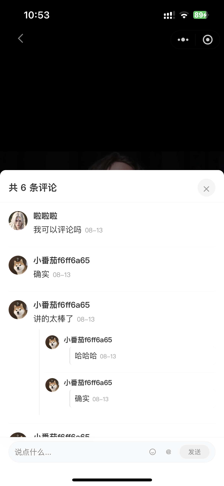
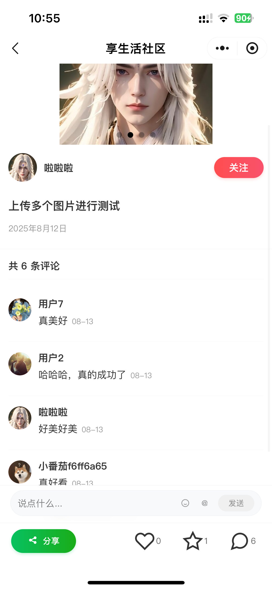
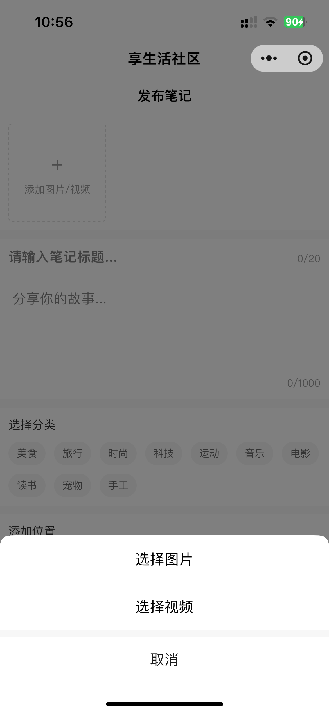
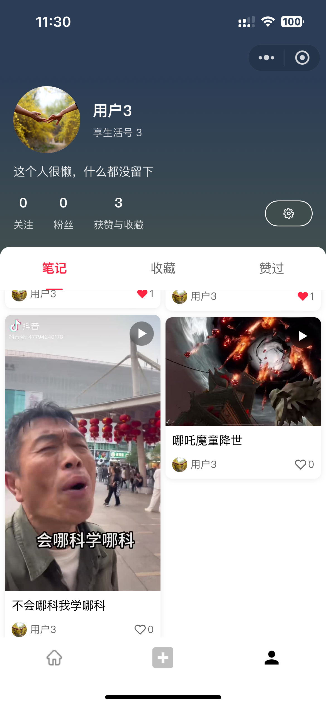
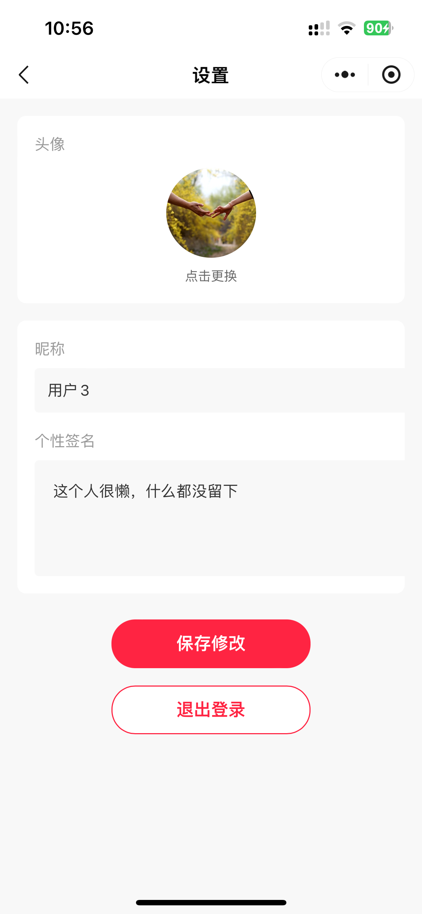
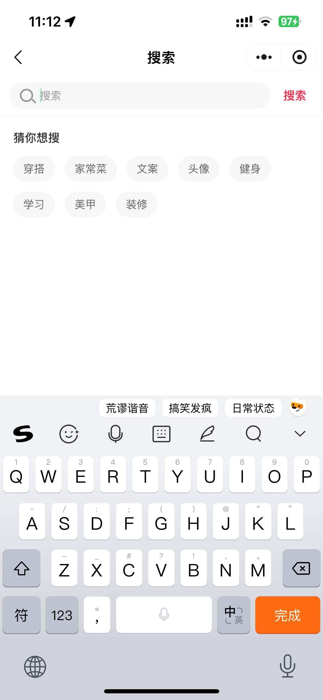
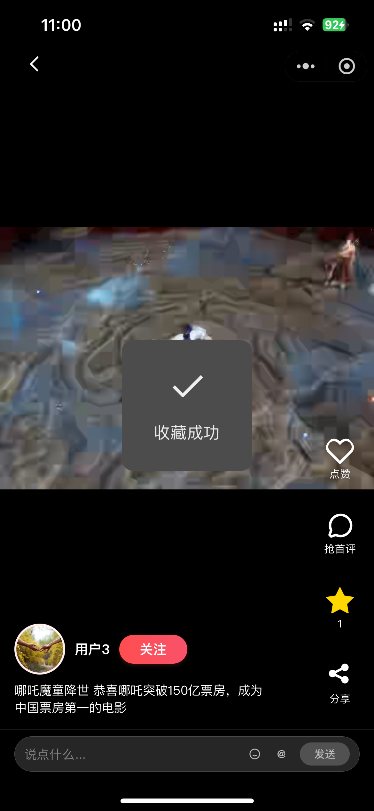

# 享生活社区微信小程序

一个分享个人生活的微信小程序，使用微信原生框架开发，后端使用 Node.js+MySQL+Express 开发。

后端访问地址：[share-life-server](https://github.com/2918894301/share-life-server)

## 效果展示

### 首页


### 视频详情页

<div style="display: flex;">
  
  
</div>

### 评论详情页



### 图片详情页



### 发布页



### 个人中心页



### 设置页



### 搜索页



### 收藏



## 功能特性

### 用户系统

- 用户登录与注册
- 个人信息管理
  - 头像上传和更新
  - 昵称修改
  - 个性签名编辑
- 个人主页展示
  - 用户基本信息展示
  - 关注/粉丝/获赞数据统计
  - 个性签名展示

### 内容管理

- 笔记管理
  - 笔记列表展示
  - 笔记卡片式布局
  - 笔记标题和内容展示
  - 笔记作者信息展示
  - 笔记点赞数显示
- 收藏功能
  - 收藏列表展示
  - 收藏内容管理
- 点赞功能
  - 点赞列表展示
  - 点赞内容管理

### 界面特性

- 现代化 UI 设计
  - 渐变色背景
  - 圆角设计
  - 卡片式布局
- 标签页切换
  - 笔记/收藏/赞过的内容切换
  - 平滑切换动画
- 响应式布局
  - 适配不同屏幕尺寸
  - 网格布局展示
- 瀑布流布局
  - 首页内容瀑布流展示
  - 自适应内容高度

## 技术栈

- 微信小程序原生框架
- 后端 Node.js + Express + MySQL
  - Express 框架
  - 用户管理
  - 数据存储
  - 文件存储
- CSS3
  - Flexbox 布局
  - Grid 布局
  - 渐变色背景
  - 动画效果

## 目录结构

```
├── pages/
│   ├── index/             # 首页
│   ├── profile/           # 个人主页
│   ├── settings/          # 设置页面
│   ├── login/             # 登录页面
│   ├── publish/           # 发布页面
│   ├── search/            # 搜索页面
│   ├── detail/            # 图片详情页
│   └── video-detail/      # 视频详情页
├── components/
│   ├── note-card/         # 笔记卡片组件
│   ├── action-bar/        # 操作栏组件
│   ├── comment-input/     # 评论输入框组件
│   └── follow-button/     # 关注按钮组件
├── utils/                 # 工具函数
├── assets/                # 静态资源
├── app.js                 # 应用入口
├── app.json               # 应用配置
└── app.wxss               # 应用样式
```

## 已实现功能

- 首页瀑布流布局
- 分类导航固定顶部
- 个人中心页面
- 笔记卡片组件
- 搜索页面
- 发布页面基础布局
- 签名设置功能

## 待实现功能

- 消息通知
- 图片上传优化
- 数据缓存优化
- 分享功能

## 开发环境

- 微信开发者工具

## 如何运行

- 克隆项目到本地
- 在微信开发者工具中导入项目
- 修改 request.js 中的 BASE_URL
- 编译运行项目

## 注意事项

- 需要在微信开发者工具中开启 ES6 转 ES5 功能
- 建议使用最新版本的微信开发者工具
- 项目使用轻量网络请求封装，支持 GET/POST/PUT/DELETE 等请求方式
- 请求封装包含统一 BASE_URL、加载提示、错误提示和自动鉴权功能
